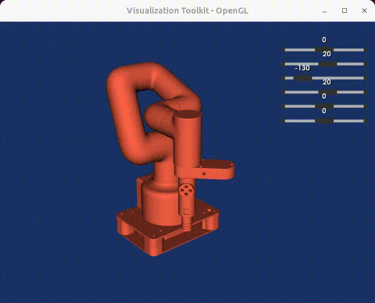

# 

[](https://github.com/neka-nat/kinpy/actions/workflows/ubuntu.yml/badge.svg)
[](https://badge.fury.io/py/kinpy)
[](LICENSE)
[](https://pepy.tech/project/kinpy)

Simple kinematics body toolkit.

## Core features

* Pure python library.
* Support URDF, SDF and MJCF file.
* Calculate FK, IK and jacobian.



## Installation

```
pip install kinpy
```

## Getting started
Here is a program that reads urdf and generates a kinematic chain.

```py
import kinpy as kp

chain = kp.build_chain_from_urdf(open("kuka_iiwa/model.urdf").read())
print(chain)
# lbr_iiwa_link_0_frame
# └──── lbr_iiwa_link_1_frame
#       └──── lbr_iiwa_link_2_frame
#             └──── lbr_iiwa_link_3_frame
#                   └──── lbr_iiwa_link_4_frame
#                         └──── lbr_iiwa_link_5_frame
#                               └──── lbr_iiwa_link_6_frame
#                                     └──── lbr_iiwa_link_7_frame
```

Displays the parameter names of joint angles included in the chain.

```py
print(chain.get_joint_parameter_names())
# ['lbr_iiwa_joint_1', 'lbr_iiwa_joint_2', 'lbr_iiwa_joint_3', 'lbr_iiwa_joint_4', 'lbr_iiwa_joint_5', 'lbr_iiwa_joint_6', 'lbr_iiwa_joint_7']
```

Given joint angle values, calculate forward kinematics.

```py
import math
th = {'lbr_iiwa_joint_2': math.pi / 4.0, 'lbr_iiwa_joint_4': math.pi / 2.0}
ret = chain.forward_kinematics(th)
# {'lbr_iiwa_link_0': Transform(rot=[1. 0. 0. 0.], pos=[0. 0. 0.]), 'lbr_iiwa_link_1': Transform(rot=[1. 0. 0. 0.], pos=[0.     0.     0.1575]), 'lbr_iiwa_link_2': Transform(rot=[-0.27059805  0.27059805  0.65328148  0.65328148], pos=[0.   0.   0.36]), 'lbr_iiwa_link_3': Transform(rot=[-9.23879533e-01  3.96044251e-14 -3.82683432e-01 -1.96942462e-12], pos=[ 1.44603337e-01 -6.78179735e-13  5.04603337e-01]), 'lbr_iiwa_link_4': Transform(rot=[-0.65328148 -0.65328148  0.27059805 -0.27059805], pos=[ 2.96984848e-01 -3.37579445e-13  6.56984848e-01]), 'lbr_iiwa_link_5': Transform(rot=[ 2.84114655e-12  3.82683432e-01 -1.87377891e-12 -9.23879533e-01], pos=[ 1.66523647e-01 -1.00338887e-12  7.87446049e-01]), 'lbr_iiwa_link_6': Transform(rot=[-0.27059805  0.27059805 -0.65328148 -0.65328148], pos=[ 1.41421356e-02 -7.25873884e-13  9.39827561e-01]), 'lbr_iiwa_link_7': Transform(rot=[ 9.23879533e-01  2.61060896e-12 -3.82683432e-01  4.81056861e-12], pos=[-4.31335137e-02 -1.01819561e-12  9.97103210e-01])}
```

You can get the position and orientation of each link.

If you want to use IK or Jacobian, you need to create a `SerialChain`.
When creating a `SerialChain`, an end effector must be specified.

```py
chain = kp.build_serial_chain_from_urdf(open("kuka_iiwa/model.urdf"), "lbr_iiwa_link_7")
th = [0.0, -math.pi / 4.0, 0.0, math.pi / 2.0, 0.0, math.pi / 4.0, 0.0]
ret = chain.forward_kinematics(th, end_only=True)
# chain.inverse_kinematics(ret)
# chain.jacobian(th)
```

## Visualization

### KUKA IIWA


### Mujoco humanoid


### Mujoco ant


### Simple arm


## Citing

```
@software{kinpy,
    author = {{Kenta-Tanaka et al.}},
    title = {kinpy},
    url = {https://github.com/neka-nat/kinpy},
    version = {0.0.3},
    date = {2019-10-11},
}
```
